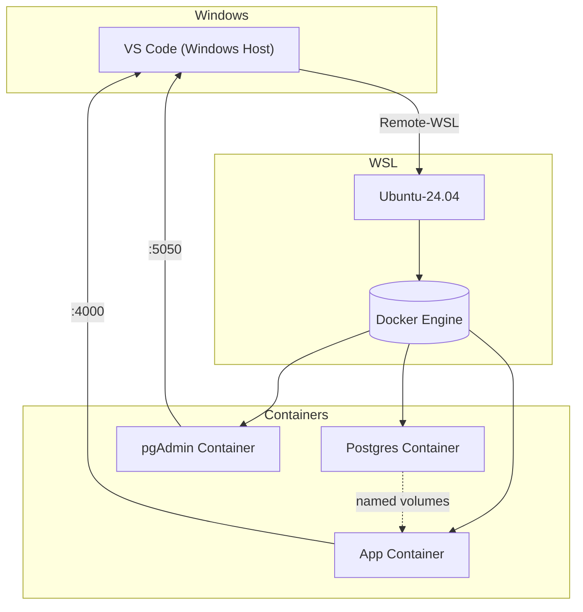

# ExIns - Insurance Management System

ExIns is a robust, full-featured insurance management platform built with Elixir, Phoenix, and the Ash Framework. It provides a comprehensive set of tools for managing contacts, policies, and applicants in a modern, real-time web application.

## About The Project

This project serves as a demonstration of building a complex web application using the power of the Phoenix Framework for real-time features and the Ash Framework for declarative resource management.

Key features include:
- **Contact Management:** A central repository for all individuals and organizations.
- **Policy Administration:** Create and manage insurance policies with different lines of business.
- **Applicant Tracking:** Handle applicants for new policies.
- **Modern Tech Stack:** Built with Elixir, Phoenix LiveView, Ash Framework, and PostgreSQL.

## Getting Started

The recommended way to get started with development is by using the included Dev Container setup with VS Code.

### Prerequisites

- [Docker Desktop](https://www.docker.com/products/docker-desktop/)
- [Visual Studio Code](https://code.visualstudio.com/)
- [Remote - Containers extension](https://marketplace.visualstudio.com/items?itemName=ms-vscode-remote.remote-containers) for VS Code.

### Installation & Setup

1.  **Clone the repository:**
    ```bash
    git clone https://github.com/sarin-rajendran-2/shiny-fiesta.git
    cd shiny-fiesta
    ```

2.  **Open in VS Code:**
    Open the cloned repository folder in Visual Studio Code.

3.  **Reopen in Container:**
    When prompted, click on "Reopen in Container". This will build the development environment inside Docker.

4.  **Set up the Elixir project:**
    Once the container is running and you have a terminal inside VS Code, run the following commands:
    ```bash
    # Navigate to the Elixir project directory
    pushd exins

    # Install dependencies
    mix deps.get

    # Compile the project
    mix compile

    # Generate code for Ash resources
    mix ash.codegen --dev

    # Run database migrations
    mix ash.migrate

    popd
    ```

5.  **Start the Phoenix Server:**
    ```bash
    # Inside the exins/ directory
    mix phx.server
    ```

You can now access the application at [http://localhost:4000](http://localhost:4000).

## Usage

The application provides a web interface to manage the core entities of an insurance system:

-   **/contacts**: View, create, edit, and delete contacts. Contacts can be individuals or organizations and hold associated information like names, addresses, and phone numbers.
-   **/policies**: Manage insurance policies. You can create new policies, associate them with applicants, and define their terms and status.
-   **/applicants**: Handle the applicants for insurance policies.

## Development Environment

ExIns uses Dev Containers to ensure a consistent and reproducible development environment.

### Environment Variables

Configuration and secrets are managed via a `.env` file in the project root. To set it up, you can use the interactive script:

```bash
./.devcontainer/scripts/setup_env.sh
```

This will create a `.env` file and prompt you for any required secrets. Alternatively, you can copy `.env.example` to `.env` and fill it out manually.

**Important:** The `.env` file should never be committed to version control.

### Data Persistence

To persist data across container rebuilds, the environment uses Docker named volumes. This is configured in the `docker-compose.yml` file and includes data for the PostgreSQL database and pgAdmin.

### Livebook

The project includes a Livebook instance for interactive documentation and code execution. The Livebook container runs in attached mode, giving it access to the main application's modules.

---

## Advanced Setup & Troubleshooting

The following sections provide more detailed information for advanced use cases and troubleshooting.

### Development on Windows with WSL2

This project supports development on Windows using WSL2 as the Docker engine host.

-   **Recommendation:** Keep the repository inside your WSL filesystem (e.g., `/home/<user>/repos`) for best performance.
-   **Docker Desktop:** Ensure the WSL2 integration is enabled for your distribution in Docker Desktop settings.

**Diagram: Port & File Flow**


### Appendix: PostgreSQL Version Upgrade

To upgrade the PostgreSQL version, you'll need to export data from the old version and import it into the new one.

1.  **Export Data:**
    ```bash
    docker exec shiny-fiesta_devcontainer-db-1 pg_dumpall -U postgres > backup.sql
    ```

2.  **Import Data:**
    ```bash
    gc backup.sql | docker exec -i shiny-fiesta_devcontainer-db-1 psql -U postgres -d exins_dev
    ```

### Troubleshooting

-   **Volume Mounts:** If you encounter issues with volume mounts, especially with sub-paths, try commenting them out in `docker-compose.yml` to start the container, then manually create the required directories and re-enable the mounts.
-   **Resetting WSL User Password:** If you forget your WSL password, you can reset it from PowerShell:
    ```powershell
    # Replace 'Ubuntu-24.04' with your distribution name
    wsl --user root --distribution Ubuntu-24.04

    # Inside the root shell, reset the password
    # Replace 'username' with your WSL username
    passwd username
    ```

## Learn More

*   Official website: https://www.phoenixframework.org/
*   Guides: https://hexdocs.pm/phoenix/overview.html
*   Docs: https://hexdocs.pm/phoenix
*   Forum: https://elixirforum.com/c/phoenix-forum
*   Source: https://github.com/phoenixframework/phoenix
*   Ash Framework: https://ash-hq.org/