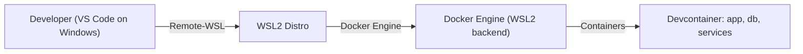
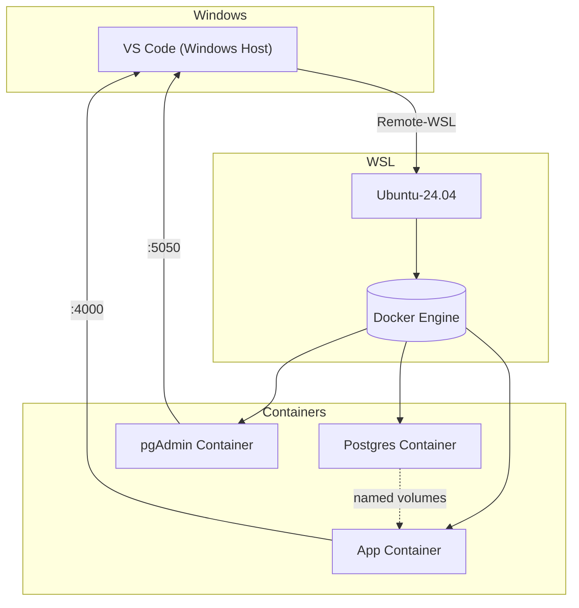

# ExIns

## Development Setup

### Prerequisites

1. Install Chocolatey
2. Install Visual Studio Code
3. Install Docker Desktop

### WSL Setup

1. Install/Enable WSL 2
   ```powershell
   # Enable Windows Subsystem for Linux and Virtual Machine Platform
   dism.exe /online /enable-feature /featurename:Microsoft-Windows-Subsystem-Linux /all /norestart
   dism.exe /online /enable-feature /featurename:VirtualMachinePlatform /all /norestart

   # Restart your computer to complete the WSL installation

   # Download and install the WSL2 Linux kernel update package
   wsl --update

   # Set WSL 2 as your default version
   wsl --set-default-version 2
   ```

2. Install WSL distro
   ```bash
   wsl --install Ubuntu-24.04
   ```

3. Install Git and setup repos
   ```bash
   sudo apt-get install git
   sudo mkdir /repos
   chown -R exins-dev:exins-dev /repos
   ```

### Project Setup

1. Clone repository
   ```bash
   https://github.com/sarin-rajendran-2/shiny-fiesta.git
   ```

2. Setup Elixir project
   ```bash
   pushd exins
   mix deps.get   # OR Run Task mix: Deps.get
   mix .compile   # OR Run Task mix: Build
   mix ash.codegen --dev
   mix ash.migrate
   ```

## Development Environment

Exins uses devcontainers for setting up the development environment and all required dependencies. Devcontainers allow the specification for the environment to be explicitly defined and maintained as Infrastructure-as-Code (IAC) ensuring automatic and consistent working environment for all contributors.

### Environment Configuration

The project uses environment variables for both configuration and secrets management. These are split into two categories:

#### Application Secrets
These should never be committed to version control:
- `POSTGRES_USER`, `POSTGRES_PASSWORD` - Database credentials
- `PGADMIN_DEFAULT_EMAIL`, `PGADMIN_DEFAULT_PASSWORD` - pgAdmin access
- `SECRET_KEY_BASE` - Phoenix secret key
- `LIVEBOOK_TOKEN` - Livebook authentication token

#### Configuration Values
These can be safely committed and are environment-specific:
- `POSTGRES_DB` - Database name
- `PGADMIN_LISTEN_PORT` - pgAdmin service port
- `LIVEBOOK_PORT` - Livebook service port
- `PHX_HOST` - Phoenix host configuration
- `PORT` - Application port

### Setting Up Environment Variables

There are two ways to set up your environment variables:

#### 1. Interactive Setup (Recommended)

Run the setup script which will prompt you for necessary secrets and generate secure values:
```bash
./.devcontainer/scripts/setup_env.sh
```

This script will:
- Create a new `.env` file if it doesn't exist
- Copy configuration values from `.env.example`
- Prompt you for secret values (passwords, emails)
- Automatically generate secure values for tokens and keys
- Leave existing `.env` file untouched if it already exists

#### 2. Manual Setup

1. Create a `.env` file in the project root:
   ```bash
   # Create from template
   cp .env.example .env
   ```

2. Update the `.env` file with your values:
   ```bash
   # Update secrets with secure values
   POSTGRES_PASSWORD=your_secure_password
   PGADMIN_DEFAULT_PASSWORD=your_secure_password
   SECRET_KEY_BASE=your_generated_key
   LIVEBOOK_TOKEN=your_secure_token

   # Configuration values can be left as defaults or adjusted as needed
   POSTGRES_DB=exins_dev
   PGADMIN_LISTEN_PORT=5050
   ```

3. Reference these variables in docker-compose.yml:
   ```yaml
   services:
     db:
       environment:
         - POSTGRES_PASSWORD=${POSTGRES_PASSWORD}
         - POSTGRES_DB=${POSTGRES_DB}
   ```

**Important Notes:**
- Never commit `.env` file to version control
- `.env.example` is tracked in git and includes safe default values
- Use `.gitignore` to exclude `.env` files
- For production deployments, use appropriate secrets management for your platform
- Configuration values can be committed in other files when needed

The development environment consists of:
1. The primary app container (image: elixir) 
2. The database service container (image: postgres)
3. The pgAdmin service container (image: dpage/pgAdmin)
4. The livebook service container (image: livebook)

The containers are orchestrated using docker compose.

### Data Persistence

One of the challenges of using a container based development environment is that any data created and used by the containers are ephemeral. While the data is retained between container restarts, it will be lost when the containers are rebuilt.

Docker volumes are defined and mounted by the containers to persist data between container restarts as well as rebuilds.
Named volumes are used to ensure portability across hosts.

| Volume | Source path | Container | Target Path |
|--------|-------------|-----------|-------------|
| postgres-data | 18/data | db | /var/lib/postgres/18/data |
| app | livebook | livebook | /data |
| app | exins/priv | app | /workspace/exins/priv |
| app | pgAdmin4/config_local.py | pgAdmin | /pgadmin4/config_local.py |

**NOTE:** Volume sub paths are required to map folders of the app volume. Some platforms e.g. Github codespaces do not support Volume sub paths.

### Livebook

Documentation for the project is maintained in interactive executable livebooks.
A Livebook sidecar container is spun up alongside the app container. The livebook container is configured to run in attached mode. It attaches to the app container and has access to all modules and tests in the application.

A VSCode task is defined to run the phoenix application with the correct parameters so that the livebook container can automatically attach itself to the application.

## Phoenix Server

To start your Phoenix server:

* Run `mix setup` to install and setup dependencies
* Start Phoenix endpoint with `mix phx.server` or inside IEx with `iex -S mix phx.server`

Now you can visit [`localhost:4000`](http://localhost:4000) from your browser.

Ready to run in production? Please [check our deployment guides](https://hexdocs.pm/phoenix/deployment.html).

## Learn more

* Official website: https://www.phoenixframework.org/
* Guides: https://hexdocs.pm/phoenix/overview.html
* Docs: https://hexdocs.pm/phoenix
* Forum: https://elixirforum.com/c/phoenix-forum
* Source: https://github.com/phoenixframework/phoenix

## Devcontainers on Windows (WSL2)

This project supports development using VS Code Devcontainers. On Windows the recommended flow is to use WSL2 as the Docker engine host. The notes below explain the common setup and how traffic flows between Windows, WSL2 and the containers.

### Quick summary

- Use WSL2 (e.g., Ubuntu-24.04) as your primary development environment.
- Install Docker Desktop for Windows and enable the WSL2 backend (or install Docker inside WSL if preferred).
- Open the repository in VS Code inside WSL and use the Remote - WSL / Dev Containers extension to open the devcontainer.

### Diagram: developer -> WSL2 -> Docker (high-level)



### Diagram: port & file flow (details)



### Tips and gotchas

- File paths: Keep the repository inside your WSL filesystem (e.g., /home/<user>/repos) to avoid performance penalties from Windows-mounted drives.
- Docker Desktop: If using Docker Desktop, enable the WSL2 integration for your distro in Docker settings.
- Permissions: If you mount Windows paths into containers, watch for permission and UID/GID mismatches; prefer WSL filesystem mounts where possible.
- Volumes: Use named volumes for DB persistence. Avoid sub-path volume mounts that some hosts don't support.

If you'd like, I can add a short troubleshooting subsection that includes commands for checking Docker/WSL status and common fixes.

## Appendix

### PostgreSQL Version Upgrade

When upgrading the version of PostgreSQL, the data files from the previous version are/may not be compatible with the new version.
The database(s) need to be exported from the older version and imported into the newer version.

#### Export Data

Exporting data is done using the pg_dumpall command:
```bash
docker exec shiny-fiesta_devcontainer-db-1 pg_dumpall -U postgres > backup.sql
```

#### Import Data

Importing data is done by executing the exported data .sql file against the new database:
```bash
gc backup.sql | docker exec -i shiny-fiesta_devcontainer-db-1 psql -U postgres -d exins_dev
```

## Troubleshooting

* Comment all volume mounts with sub paths. Sometimes switching between root/non-root user or docker compose properties (e.g. project name) causes issues with volumes.

* Volume mapping with sub paths require the mapped folder/directory/file to exist. When setting up the environment for the first time, run without the mappings and create the required folders and/or files.

### Resetting WSL User Password

If you need to reset your WSL user password, you can do this in two ways:

1. From within WSL (if you know your current password):
   ```bash
   passwd
   ```

2. From Windows PowerShell (if you forgot your password):
   ```powershell
   # Replace 'Ubuntu-24.04' with your distribution name if different
   wsl --user root --distribution Ubuntu-24.04
   
   # Once in the root shell, reset the user's password
   # Replace 'username' with your actual WSL username
   passwd username
   
   # Exit the root shell
   exit
   ```

You can check your WSL distribution name using:
```powershell
wsl --list --verbose
```
